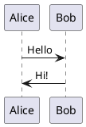
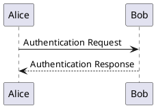
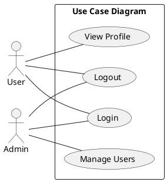
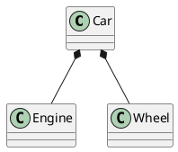
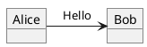
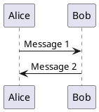
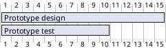
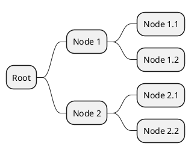
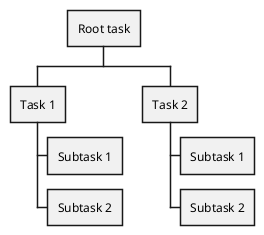

# PlantUML

PlantUML is a tool that allows you to create diagrams from a simple text language.

The following diagram types are supported:

- Sequence diagram
- Usecase diagram
- Class diagram
- Object diagram
- Activity diagram
- Component diagram
- Deployment diagram
- State diagram
- Timing diagram
- JSON data
- YAML data
- EBNF diagram
- Regex diagram
- Network diagram (nwdiag)
- UI mockups (salt)
- Archimate diagram
- Specification and Description Language (SDL)
- Ditaa diagram
- Gantt chart
- Chronology diagram
- Mindmap diagram
- WBS diagram
- Mathematics with AsciiMath or JLaTeXMath notation
- Information Engineering (IE) diagram
- Entity Relationship (ER) diagram

## Installation

PlantUML requires Java to run. You can download the PlantUML JAR file from the [official website](https://plantuml.com/download).

## Usage

To generate a diagram, create a text file with the `.puml` extension and write the diagram code using the PlantUML syntax. For example, to create a sequence diagram, you can use the following code:

```
@startuml
Alice -> Bob: Hello
Bob -> Alice: Hi!
@enduml
```



Save the file and run the PlantUML JAR file with the text file as an argument:

```bash
java -jar plantuml.jar diagram.puml
```

This will generate an image file with the diagram. You can embed the generated image in your documentation or presentations.

## Examples

### Sequence diagram

```
@startuml
Alice -> Bob: Authentication Request
Bob --> Alice: Authentication Response
@enduml
```



### Usecase diagram

```
@startuml
left to right direction
skinparam packageStyle rectangle
actor User
actor Admin
rectangle "Use Case Diagram" {
  User -- (Login)
  User -- (Logout)
  User -- (View Profile)
  Admin -- (Login)
  Admin -- (Logout)
  Admin -- (Manage Users)
}
@enduml
```



### Class diagram

```
@startuml
class Car
class Engine
class Wheel
Car *-- Engine
Car *-- Wheel
@enduml
```



### Object diagram

```
@startuml
object Alice
object Bob
Alice -> Bob: Hello
@enduml
```



### Timing diagram

```
@startuml
participant Alice
participant Bob
Alice -> Bob: Message 1
Bob -> Alice: Message 2
@enduml
```



### Gantt chart

```
@startgantt
[Prototype design] lasts 15 days
[Prototype test] lasts 10 days
@endgantt
```



### Mindmap diagram

```
@startmindmap
* Root
** Node 1
*** Node 1.1
*** Node 1.2
** Node 2
*** Node 2.1
*** Node 2.2
@endmindmap
```



### WBS diagram

```
@startwbs
+ Root task
++ Task 1
+++ Subtask 1
+++ Subtask 2
++ Task 2
+++ Subtask 1
+++ Subtask 2
@endwbs
```



## Conclusion

PlantUML is a powerful tool for creating diagrams from simple text descriptions. It supports a wide range of diagram types and is easy to use. Whether you need to create UML diagrams, network diagrams, or flowcharts, PlantUML can help you visualize your ideas effectively.

## References

- [PlantUML Official Website](https://plantuml.com/)
- [PlantUML Language Reference Guide](https://plantuml.com/guide)
