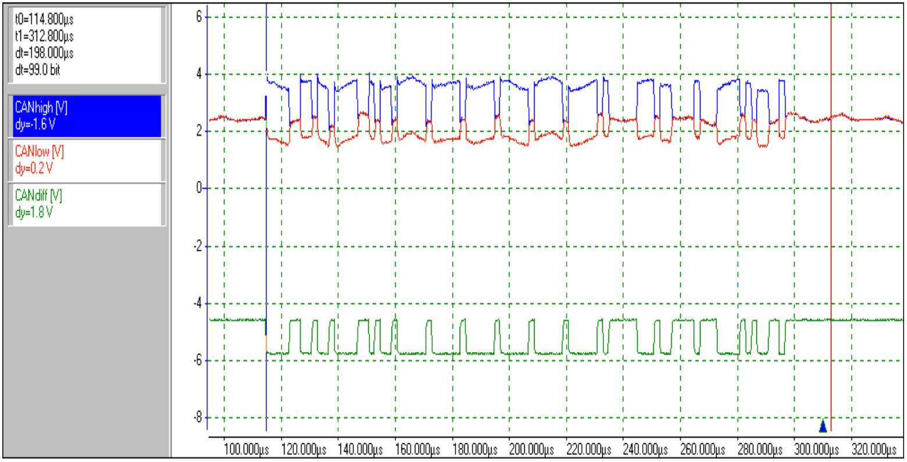
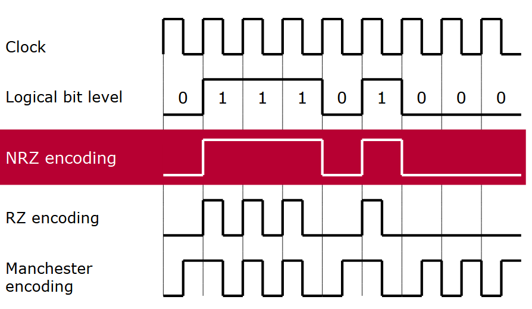

# More about CAN

## CAN Physical Layer

The Controller Area Network (CAN) physical layer handles the transmission and reception of electrical signals over the bus. It defines the bus's electrical characteristics, including voltage levels, signal timing, and termination, ensuring reliable communication between connected devices and optimal network performance.

### CAN Physical Medium

The CAN physical medium is crucial for ensuring reliable communication between nodes in a CAN system.

#### Physical Layer Basics
- Defines how data is transmitted over the communication medium (wires).
- Uses a **twisted-pair cable** to minimize electromagnetic interference (EMI) and ensure data integrity.

#### Signal Lines
- **CAN High (CAN-H)** and **CAN Low (CAN-L)** are used for differential signaling.
    - **Dominant State**: CAN-H ≈ 3.5V, CAN-L ≈ 1.5V.
    - **Recessive State**: Both ≈ 2.5V.
- Differential signaling ensures robust communication in noisy environments.

#### Termination
- The CAN bus is terminated with **120-ohm resistors** at both ends.
- These resistors match the cable's characteristic impedance, preventing signal reflections and maintaining signal integrity.

#### Bus Length and Data Rates
- At **1 Mbps**, the maximum bus length is approximately **40 meters**.
- At **125 kbps**, the length can extend up to **500 meters**.

#### Shielding
- Shielded cables may be used in high electrical noise environments for additional EMI protection.

#### Reliability Features
- Supports fault-tolerant communication. If one signal line (CAN-H or CAN-L) is damaged, communication can still occur.

### CAN Bus Topology

The CAN bus uses a **linear bus topology**, efficient for robust and real-time communication between nodes in embedded systems.

#### Key Features of CAN Bus Topology

1. **Bus Structure**:
    - A two-wire system **CAN High (CAN-H)** and **CAN Low (CAN-L)**.
    - Twisted pair design reduces EMI.

2. **Terminating Resistors**:
    - Each end of the CAN bus has a **120-ohm terminating resistor** to prevent signal reflections and ensure signal integrity.

3. **Nodes**:
    - Any device connected to the CAN bus (e.g., sensors, ECUs, actuators).
    - Nodes are connected in parallel and can send and receive messages.

4. **Star and Hybrid Variations**:
    - Primary topology is linear, but **star** or **hybrid configurations** can be used with considerations for line reflections and impedance.

5. **Cable Length**:
    - Maximum length depends on bitrate.
        - At 1 Mbps, maximum length is approximately **40 meters**.
        - At lower bitrates, length can extend to several hundred meters.

6. **Fault Tolerance**:
    - Operates even with one wire (CAN-H or CAN-L) damaged, making it highly fault-tolerant.

### Bus Logic

In a CAN bus system:

1. **Bus Levels**: Two signal levels—dominant and recessive.
2. **Dominant Signal**: Takes precedence and overwrites a recessive signal when transmitted simultaneously by different nodes.
3. **Polarity**: Physical signal response aligns with logical signal response, ensuring clear communication.

### **Reliable Recovery in Serial Transmission Systems**

Reliable recovery of the information on the receiver side plays a crucial role in a serial transmission system. To eliminate the need for a separate clock line, **line codes** were developed, allowing the clock signal to be obtained from the useful signals arriving at the receiver.

### **NRZ Encoding in CAN**

**NRZ (Non-Return-to-Zero) encoding** is utilized in CAN for two main reasons:
1. **Low Electromagnetic Emissive Power**: Reduces interference and ensures signal clarity.
2. **Full Utilization of Transmission Bandwidth**: Maximizes the efficiency of data transfer.

#### **Key Features of NRZ Encoding**:
- Each bit is represented by a **constant signal level** over the bit time.
- This enables **simple sampling**, where only **one sample per bit time** is sufficient for decoding.

### encoding

