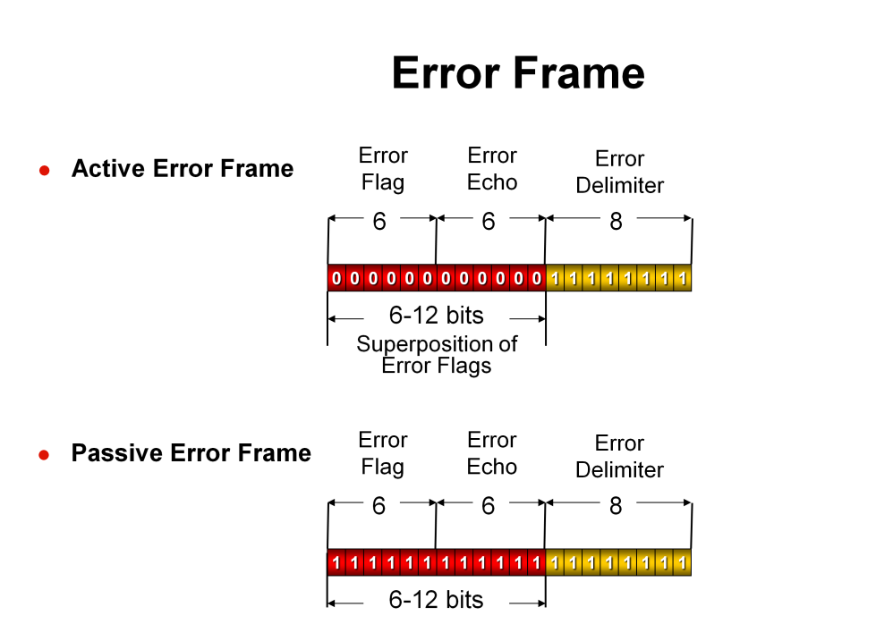
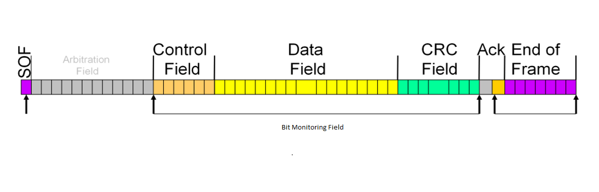
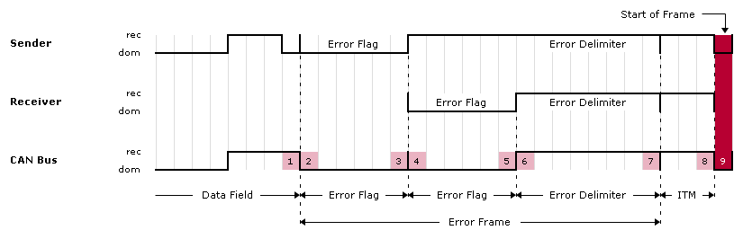

# Controller Area Network (CAN)

## CAN Protocol

### Overview

- Serial communication protocol.
- Designed for robust and reliable communication.
- Widely used in automotive, industrial, and aerospace systems.

### Features
- Multi-master, message-oriented protocol.
- Allows multiple devices to communicate over a shared bus.
- High reliability, low latency, and fault-tolerant capabilities.

### Applications

#### Automotive systems

- Engine control units (ECUs).
- Anti-lock braking systems (ABS).
- Airbag systems.

#### Industrial automation

- Factory automation.
- Robotics.
- Process control.

#### Aerospace systems

- Avionics.
- Flight control systems.
- In-flight entertainment systems.


## Difference between CAN and other communication protocols like I2C, UART, LIN and Ethernet

### CAN vs. Other Protocols

#### CAN vs. I2C

- **CAN**
    - Multi-master, message-oriented protocol.
    - Used for robust communication in noisy environments.
    - Supports longer distances and higher data rates.
- **I2C**
    - Multi-master, addressable protocol.
    - Designed for short-distance communication between devices on the same board.

#### CAN vs. UART

- **CAN**
    - Multi-master, message-oriented protocol.
    - Used for robust communication in harsh environments.
    - Supports longer distances and higher data rates.
- **UART**
    - Point-to-point, character-oriented protocol.
    - Commonly used for serial communication between two devices.

#### CAN vs. LIN

- **CAN**
    - Multi-master, message-oriented protocol.
    - Used for robust communication in harsh environments.
    - Supports longer distances and higher data rates.
- **LIN**
    - Single-master, message-oriented protocol.
    - Designed for low-cost, low-speed communication in automotive applications.

#### CAN vs. Ethernet

- **CAN**
    - Serial communication protocol.
    - Used for robust communication in harsh environments.
    - Supports shorter distances and lower data rates.
- **Ethernet**
    - Network protocol.
    - Used for high-speed communication over local area networks (LANs) and wide area networks (WANs).

## Different types of CAN frames

### Data Frame

- Data Frame is used to transmit data between nodes.
- Contains the message identifier, data, and control information.
- CAN Data Frame Structure:
    - SOF(Start of Frame): Marks the beginning of the frame. Single dominant bit.
    - Arbitration Field
        - Standard Format:
            - 11-bit identifier.
            - RTR (Remote Transmission Request) bit.
        - Extended Format:
            - 11-bit base identifier.
            - SRR (Substitute Remote Request) bit.
            - IDE (Identifier Extension) bit.
            - 18-bit extended identifier.
            - RTR (Remote Transmission Request) bit.
    - Control Field
        - Standard Format:
            - IDE (Identifier Extension) bit.
            - r (Reserved) bit.
            - DLC (Data Length Code) bits.
        - Extended Format:
            - r1 (Reserved) bit.
            - r0 (Reserved) bit.
            - DLC (Data Length Code) bits.
    - Data Field
        - Contains the actual data payload.
        - size: 0-8 bytes.
    - CRC Field
        - CRC Sequence: 15-bit CRC.
        - CRC Delimiter: 1 recessive bit.
    - ACK Field
        - ACK Slot: 1 recessive bit.
        - ACK Delimiter: 1 recessive bit.
    - EOF (End of Frame): Marks the end of the frame. 7 recessive bits.

### Remote Frame

- Remote Frame used to request data from another node.
- Similar to Data Frame but with RTR bit set.
- Contains the identifier of the requested data frame.
- Remote node responds with a Data Frame containing the requested data.
- CAN Remote Frame Structure:
    - SOF(Start of Frame): Marks the beginning of the frame. Single dominant bit.
    - Arbitration Field
        - Standard Format:
            - 11-bit identifier.
            - RTR (Remote Transmission Request) bit.
        - Extended Format:
            - 11-bit base identifier.
            - SRR (Substitute Remote Request) bit.
            - IDE (Identifier Extension) bit.
            - 18-bit extended identifier.
            - RTR (Remote Transmission Request) bit.
    - Control Field
        - Standard Format:
            - IDE (Identifier Extension) bit.
            - r (Reserved) bit.
            - DLC (Data Length Code) bits.
        - Extended Format:
            - r1 (Reserved) bit.
            - r0 (Reserved) bit.
            - DLC (Data Length Code) bits.
    - CRC Field
        - CRC Sequence: 15-bit CRC.
        - CRC Delimiter: 1 recessive bit.
    - ACK Field
        - ACK Slot: 1 recessive bit.
        - ACK Delimiter: 1 recessive bit.
    - EOF (End of Frame): Marks the end of the frame. 7 recessive bits.

### Error Frame

- Error Frame used to indicate errors in message transmission.
- Sent by a node when an error is detected.
- Contains an error flag and an error delimiter.
- CAN Active Error Frame:
    - Error Flag
        - Primary Error Flag: 6 dominant bits.
        - Secondary Error Flag: 0 - 6 dominant bits.
    - Error Delimiter: 8 recessive bits.
- CAN Passive Error Frame:
    - Error Flag
        - Primary Error Flag: 6 dominant bits.
        - Secondary Error Flag: 0 - 6 dominant bits.
    - Error Delimiter: 8 recessive bits.

### Overload Frame

- Overload Frame used to delay transmission of subsequent frames.
- Sent by a node to signal bus overload conditions.
- Contains an overload flag and an overload delimiter.
- CAN Overload Frame:
    - Superposition of Overload FlagS:
        - Overload Flag: 6 dominant bits.
        - Overload Echo: 0 - 6 dominant bits.
    - Overload Delimiter: 8 recessive bits.

## Bit rate in CAN communication

In Controller Area Network (CAN) communication, the bit rate, or baud rate, determines the speed at which data is transmitted, typically expressed in kilobits per second (kbps) or megabits per second (Mbps). Standard CAN supports bit rates up to 1 Mbps, while CAN-FD allows for higher bit rates, including a data bit rate of up to 10 Mbps. The bit rate is a critical parameter in CAN communication as it affects the speed of data transmission over the bus, the maximum bus length, the number of nodes, and overall network performance.

### Bit Rate vs. Baud Rate

- **Bit Rate:** The number of bits transmitted per second.
- **Baud Rate:** The number of signal changes per second.
- In binary systems, they are often equal.

### Common Bit Rates

- **Standard CAN:** Up to 1 Mbps. 125 kbps, 250 kbps, 500 kbps, 1000 kbps (1 Mbps).
- **CAN FD:** Up to 10 Mbps. While the arbitration bit rate is limited to 1 Mbps, the data bit rate can be significantly higher, with common values including 2 Mbps, 5 Mbps, and even 8 Mbps.

## Difference between standard CAN (CAN 2.0A) and extended CAN (CAN 2.0B)

### Standard CAN (CAN 2.0A)
- Uses an 11-bit identifier for message arbitration.
- Supports up to 2048 unique identifiers.
- Limited to non-time-critical messages.

### Extended CAN (CAN 2.0B)
- Uses a 29-bit identifier for message arbitration.
- Supports up to 536 million unique identifiers.
- Used for time-critical messages or when more unique identifiers are required.

## What is an identifier in a CAN message, and what are its types ?

### Identifier in a CAN Message

#### Standard Identifier (11 bits)
- Used in standard CAN frames.
- Supports up to 2048 unique identifiers.

#### Extended Identifier (29 bits)
- Used in extended CAN frames.
- Supports up to 536 million unique identifiers.

#### Significance
- Determines message priority on the bus.
- Lower identifier values have higher priority.
- Ensures orderly communication and collision avoidance.

## Role of the ACK (Acknowledgment) Bit in CAN Protocol

### Purpose
- Confirms successful message transmission.
- Ensures reliable communication between nodes.

### Operation
- Sender monitors the bus for the ACK bit.
- If ACK bit is received:
    - Indicates message was successfully received by at least one node.
- If ACK bit is not received:
    - Indicates an error occurred during transmission.
    - Sender retries sending the message.

### Importance
- Helps detect transmission errors.
- Ensures data integrity and reliability.

## Physical Layer of CAN Communication

### Physical Medium
- Twisted pair cables.
- Ensures signal integrity and reduces electromagnetic interference (EMI).

### Signal Lines
- CAN_H (High) and CAN_L (Low).
- Differential signaling for noise immunity.

### Termination
- Resistors at both ends of the bus.
- Prevents signal reflections and ensures signal integrity.

### Bus Length
- Maximum length depends on bit rate.
- Longer bus lengths require lower bit rates.

### Data Rates
- Standard CAN supports up to 1 Mbps.
- CAN FD (Flexible Data-rate) supports higher data rates.

### Shielding
- Optional shielding for additional EMI protection.
- Used in noisy environments.

### Reliability Features
- Error detection and correction mechanisms.
- Ensures robust and reliable communication.

## How are errors detected in CAN Protocol ?

### Error Detection in CAN Protocol

#### Cyclic Redundancy Check (CRC)
- Mathematical algorithm used to detect errors in transmitted data.
- Ensures data integrity by verifying the checksum.

#### Bit Monitoring
- Nodes monitor the bus for errors during message transmission.
- Detects discrepancies between transmitted and received bits.

#### Bit Stuffing
- Ensures data integrity by inserting additional bits.
- Avoids long sequences of identical bits to maintain synchronization.

#### Error Frames
- Sent by nodes to indicate errors in message transmission.
- Consists of an error flag and an error delimiter.

#### Error Flags
- Raised by nodes to signal error conditions.
- Helps in identifying and isolating faulty nodes.

#### Error Counters
- Track the number of errors detected by each node.
- Includes Transmit Error Counter (TEC) and Receive Error Counter (REC).

#### Error Detection and Handling
- Nodes use error flags and counters to detect and handle errors.
- Implements error confinement to prevent faulty nodes from disrupting the network.

## CRC Field in a CAN Frame

### Purpose

- Detects errors in the transmitted data.
- Ensures data integrity and reliability.

### Calculation

- Checksum calculated based on the data in the frame.
- Uses a polynomial division algorithm.

### Verification

- Receiver recalculates the CRC based on the received data.
- Compares recalculated CRC with the received CRC.
- If values match:
    - Data is considered error-free.
- If values do not match:
    - Error is detected.
    - Frame is discarded or flagged for retransmission.

### Importance

- Critical for maintaining data integrity.
- Helps in identifying and correcting transmission errors.

## Arbitration Process in CAN Protocol

### Purpose
- Determines message priority on the bus.
- Ensures orderly communication and collision avoidance.

### Process
- Nodes monitor the bus for ongoing transmissions.
- Nodes compare their message identifiers with those on the bus.
- Lower identifier values have higher priority.

### Collision Detection
- Nodes detect collisions if multiple nodes transmit simultaneously.
- Node with lower priority identifier stops transmitting.
- Node with higher priority identifier continues transmission.

### Retransmission
- Nodes that lose arbitration retry transmission after a random delay.
- Ensures fair access to the bus for all nodes.

### Importance
- Prevents data corruption.
- Ensures reliable and efficient communication.

## How does CAN handle priority among messages ?

### How does CAN handle priority among messages?

#### Priority Handling in CAN

- **Identifier-Based Priority**
    - Lower identifier values have higher priority.
    - Ensures orderly communication and collision avoidance.
- **Message Queuing**
    - Messages are queued based on their identifiers.
    - Higher priority messages are transmitted first.
- **Collision Resolution**
    - Nodes detect collisions and resolve them based on identifier values.
    - Node with lower priority stops transmitting.
    - Node with higher priority continues transmission.
- **Retransmission**
    - Nodes that lose arbitration retry transmission after a random delay.
    - Ensures fair access to the bus for all nodes.
- **Importance**
    - Ensures timely delivery of critical messages.
    - Prevents data loss and corruption.

## What are the functions of the following fields in a CAN frame: SOF, EOF, and Control field ?

### Functions of Fields in a CAN Frame

#### Start of Frame (SOF)
- Marks the beginning of a CAN frame.
- Synchronizes nodes for message reception.

#### End of Frame (EOF)
- Marks the end of a CAN frame.
- Signals the completion of message transmission.

#### Control Field
- Contains control information for the frame.
- Includes frame type, data length, and error flags.
- Ensures proper frame reception and processing.

### What is "bit stuffing," and why is it used in CAN Protocol ?

### Bit Stuffing in CAN Protocol

#### Purpose
- Ensures data integrity and synchronization.
- Prevents long sequences of identical bits.

#### Operation
- Inserts an extra bit after five consecutive bits of the same value.
- Maintains synchronization between sender and receiver.

#### Importance
- Prevents errors due to long sequences of identical bits.
- Ensures reliable communication over the bus.

## Limitations of CAN Protocol

### Data Rate
- Limited to 1 Mbps in standard CAN.
- Higher data rates require CAN FD.

### Bus Length
- Maximum bus length depends on bit rate.
- Longer bus lengths require lower bit rates.

### Number of Nodes
- Limited by bus length and data rate.
- Higher data rates may limit the number of nodes.

### Error Handling
- Limited error detection and correction mechanisms.
- Requires additional protocols for fault tolerance.

### Message Priority
- Priority-based arbitration may lead to message delays.
- Critical messages may be delayed by lower-priority messages.

### Cost
- Requires specialized hardware and software.
- Implementation costs may be higher than other protocols.

## Ensuring Data Integrity in CAN

### Error Detection
- **Cyclic Redundancy Check (CRC):** Used for data verification.
- **Bit Monitoring:** Detects errors during transmission.

### Error Handling
- **Error Frames:** Indicate transmission errors.
- **Error Counters:** Track error rates.

### Acknowledgment (ACK) Bit
- **Purpose:** Confirms successful message reception.
- **Importance:** Ensures reliable communication between nodes.

### Bit Stuffing
- **Purpose:** Prevents long sequences of identical bits.
- **Importance:** Maintains synchronization and data integrity.

### Priority Handling
- **Identifier-Based Arbitration:** Determines message priority.
- **Importance:** Ensures orderly communication and collision avoidance.

## Purpose of CANopen Protocol

### Overview

- Higher-layer protocol based on CAN.
- Defines communication profiles for various applications.
- Used in industrial automation, medical devices, and other fields.

### Features

- Standardized communication objects and services.
- Device and network management functions.
- Supports plug-and-play device integration.

## Differences from Raw CAN

### Higher-Level Protocol

- Adds application layer services to CAN.
- Defines standardized communication objects.

### Device and Network Management

- Supports device configuration and management.
- Enables network-wide synchronization and diagnostics.

### Plug-and-Play Integration

- Simplifies device integration and configuration.
- Allows devices to be added or removed dynamically.

## Can you explain the error types in CAN communication, such as bit error, stuff error, and CRC error ?

### Error Types in CAN Communication

#### Bit Error
- Occurs when a transmitted bit is received with the wrong value.
- Detected by comparing transmitted and received bits.

#### Stuff Error
- Occurs when bit stuffing rules are violated.
- Detected during frame reception.

#### CRC Error
- Occurs when the calculated CRC does not match the received CRC.
- Detected during data verification.

### Error Detection
- Nodes monitor the bus for errors during transmission.
- Use error flags and counters to detect and handle errors.

## How do you analyze and debug issues in CAN communication ?

```markdown
## Analyzing and Debugging CAN Communication

### Error Detection
- Monitor error flags and counters on nodes.
- Identify faulty nodes and error conditions.

### Bus Monitoring
- Use CAN bus analyzers to monitor bus traffic.
- Capture and analyze CAN frames for errors.

### Signal Integrity
- Check physical layer components (cables, terminations).
- Ensure proper signal levels and noise immunity.

### Protocol Analysis
- Analyze CAN frames for errors and data integrity.
- Verify message priority and arbitration.

### Simulation and Testing
- Use simulation tools to test CAN communication.
- Verify system behavior under different conditions.
```

## Advantages and Disadvantages of CAN FD (Flexible Data-Rate CAN) compared to classical CAN

### Advantages of CAN FD

- **Higher Data Rates**
    - Supports data rates up to 8 Mbps.
    - Faster transmission of large data packets.
- **Increased Payload**
    - Supports up to 64 bytes of data per frame.
    - Allows larger data packets to be transmitted.
- **Backward Compatibility**
    - Compatible with existing CAN networks.
    - Supports both CAN FD and classical CAN frames.

### Disadvantages of CAN FD

- **Complexity**
    - Requires additional hardware and software support.
    - Implementation may be more complex than classical CAN.
- **Cost**
    - Higher implementation costs.
    - Requires specialized CAN FD controllers and transceivers.
- **Interoperability**
    - Limited interoperability with classical CAN devices.
    - Requires all nodes to support CAN FD for full benefits.

## How would you implement a custom CAN Protocol driver in an embedded system ?

### Hardware Configuration

- **Select**
    - CAN controller and transceiver.
    - Microcontroller with CAN support.
- **Connect**
    - CAN controller to the microcontroller.

### Software Development

- **Initialize**
    - CAN controller and transceiver.
    - Configure bit rate and bus timing.
- **Implement**
    - Transmit and receive functions.
    - Error handling and recovery.
- **Test**
    - Send and receive CAN frames.
    - Verify data integrity and error handling.

### Integration

- **Integrate**
    - CAN driver with application code.
    - Implement higher-level protocol features.
- **Test**
    - Verify communication with other nodes.
    - Debug issues and optimize performance.

## Designing a Fault-Tolerant CAN Network

### Redundancy
- **Use**
    - Multiple CAN buses or channels.
    - Dual-redundant communication paths.
- **Benefits**
    - Increases reliability and fault tolerance.
    - Allows continued operation in case of bus or node failure.

### Error Detection
- **Implement**
    - Error detection mechanisms (CRC, bit monitoring).
    - Error flags and counters for fault detection.
- **Monitor**
    - Error rates and bus status.
    - Identify faulty nodes and error conditions.

### Error Handling
- **Implement**
    - Error confinement and recovery strategies.
    - Retransmission mechanisms for lost messages.
- **Ensure**
    - Data integrity and reliable communication.
    - Fault tolerance and system robustness.

### Redundant Nodes
- **Use**
    - Redundant nodes for critical functions.
    - Backup nodes for seamless failover.
- **Ensure**
    - Continuous operation in case of node failure.
    - Minimal impact on system performance.


## Key Differences between CAN FD and ISO CAN FD

### CAN FD
- Developed by Bosch.
- Supports data rates up to 8 Mbps.
- Allows up to 64 bytes of data per frame.

### ISO CAN FD
- Standardized by ISO (ISO 11898-1:2015).
- Supports data rates up to 5 Mbps.
- Allows up to 64 bytes of data per frame.

### Backward Compatibility
- **Ensure:**
    - Support for both CAN FD and ISO CAN FD frames.
    - Compatibility with existing CAN networks.
- **Implement:**
    - Protocol negotiation for frame format.
    - Dual-mode controllers for seamless transition.

## How does Time-Triggered CAN (TTCAN) enhance deterministic communication over traditional CAN ?

## Enhancing Deterministic Communication with TTCAN

### Time-Triggered Communication
- **Schedules**
    - Time slots for message transmission.
    - Ensures predictable and deterministic communication.
- **Reduces**
    - Message latency and jitter.
    - Improves real-time performance.

### Time-Triggered CAN (TTCAN)
- **Adds**
    - Time-triggered communication to CAN.
    - Supports time-critical applications.
- **Benefits**
    - Deterministic message transmission.
    - Improved fault tolerance and reliability.

### Synchronization
- **Nodes synchronize their clocks for time-triggered communication.**
- **Ensures accurate message scheduling and transmission.**

### Redundancy
- **Supports**
    - Dual-channel communication for fault tolerance.
    - Backup channels for seamless failover.
- **Ensures**
    - Continuous operation in case of bus or node failure.
    - Minimal impact on system performance.

## Implications of Bus Loading in High-Speed CAN

### Bus Loading

- Refers to:
    - The amount of data transmitted over the bus.
    - The impact on bus performance and reliability.

### Implications

#### High Bus Loading

- Increases:
    - Message latency and jitter.
    - Risk of message collisions.
- Decreases:
    - Bus throughput and efficiency.
    - Network reliability and fault tolerance.

#### Low Bus Loading

- Improves:
    - Message transmission times.
    - Network performance and reliability.
- Reduces:
    - Risk of message collisions.
    - Bus congestion and contention.

### Optimization

- Balance:
    - Data transmission rates and bus loading.
    - Message priorities and network traffic.
- Optimize:
    - Message scheduling and transmission.
    - Bus utilization and efficiency.

## Handling CAN Bus Off Recovery

### Bus Off State
- **Occurs**
    - When a node exceeds the error limit.
    - Node is unable to transmit or receive messages.

### Recovery Strategies
- **Reset**
    - CAN controller and transceiver.
    - Clear error flags and counters.
- **Retry**
    - Transmission after a delay.
    - Ensure bus is free of errors.

### Error Handling
- **Monitor**
    - Error rates and bus status.
    - Identify faulty nodes and error conditions.
- **Implement**
    - Error confinement and recovery strategies.
- **Ensure**
    - Data integrity and reliable communication.
    - Fault tolerance and system robustness.

## Impact of Dominant and Recessive Bits on CAN Bus

### Dominant Bit
- **Represents**
    - Logical 0 on the bus.
    - Overwrites recessive bits.
- **Ensures**
    - Clear communication and message priority.
    - Collision resolution and arbitration.

### Recessive Bit
- **Represents**
    - Logical 1 on the bus.
    - Yields to dominant bits.
- **Ensures**
    - Message integrity and synchronization.
    - Error detection and fault tolerance.

### Influence on Communication
- Dominant bits take precedence over recessive bits, ensuring that higher priority messages are transmitted first.
- The arbitration process relies on the dominance of bits to resolve conflicts and determine which node can transmit.
- Error detection mechanisms use the difference between dominant and recessive bits to identify transmission errors.

## What techniques can be used to ensure real-time behavior in a CAN-based system ?

### Time-Triggered Communication
- **Schedules**
    - Message transmission based on time slots.
    - Ensures predictable and deterministic communication.

### Priority-Based Arbitration
- **Assigns**
    - Message priorities based on identifiers.
    - Ensures timely delivery of critical messages.

### Bus Monitoring
- **Detects**
    - Errors and bus status in real-time.
    - Ensures reliable communication and fault tolerance.

### Synchronization
- **Nodes synchronize**
    - Clocks for time-critical applications.
    - Ensures accurate message scheduling and transmission.

### Redundancy
- **Implements**
    - Dual-channel communication for fault tolerance.
    - Backup channels for seamless failover.
- **Ensures**
    - Continuous operation in case of bus or node failure.
    - Minimal impact on system performance.

## Optimizing CAN Network Performance in Automotive Systems

### Bus Loading
- **Balance**
    - Data transmission rates and bus loading.
    - Message priorities and network traffic.

### Message Scheduling
- **Optimize**
    - Message transmission times and intervals.
    - Bus utilization and efficiency.

### Error Handling
- **Implement**
    - Error detection and recovery mechanisms.
    - Ensure data integrity and reliable communication.

### Redundancy
- **Use**
    - Dual-channel communication for fault tolerance.
    - Backup channels for seamless failover.

### Bus Topology
- **Optimize**
    - Bus length and termination.
    - Ensure signal integrity and noise immunity.

### Protocol Features
- **Utilize**
    - CAN FD for higher data rates.
    - Time-Triggered CAN for deterministic communication.

## How does CAN integrate with higher-layer protocols like J1939 and OBD-II ?

### J1939

#### Overview
- Higher-layer protocol for heavy-duty vehicles.
- Defines communication profiles and message formats.

#### Integration
- **Use**
    - J1939-compatible devices and software.
    - Implement J1939 message formats and services.
- **Ensure**
    - Compatibility with existing J1939 networks.
    - Compliance with J1939 standards.

### OBD-II

#### Overview
- On-Board Diagnostics standard for vehicles.
- Monitors vehicle systems and emissions.

#### Integration
- **Use**
    - OBD-II scanners and diagnostic tools.
    - Implement OBD-II communication protocols.
- **Ensure**
    - Compliance with OBD-II standards.
    - Accurate diagnostics and fault detection.

## CAN high speed and low speed voltage levels for dominant and recessive states.

### High-Speed CAN

#### Dominant State
- Differential Voltage > 2V
- CAN_H ≈ 3.5V
- CAN_L ≈ 1.5V

#### Recessive State
- Differential Voltage ≈ 0V
- CAN_H ≈ 2.5V
- CAN_L ≈ 2.5V

### Low-Speed CAN

#### Dominant State
- CAN_H: Higher Voltage
- CAN_L: Lower Voltage

#### Recessive State
- Differential Voltage ≈ 0V
- CAN_H = CAN_L

## CAN Errors

### Error Frame



### Types of Errors

#### CRC Error

- CRC Error occurs when the calculated CRC does not match the received CRC.
- Detected during data verification.
- Indicates data corruption or transmission errors.
- Frame is discarded or flagged for retransmission.
- Importance: Critical for maintaining data integrity.
- Helps in identifying and correcting transmission errors.


#### Acknowledgment Error

- Acknowledgment Error occurs when a node does not receive an ACK bit after transmitting a message.
- Detected by the sender when no ACK bit is received.
- Indicates communication issues or node failure.
- May lead to message loss or data corruption.
- Importance: Ensures reliable communication between nodes.


#### Bit Error

- Bit Error occurs when a transmitted bit is received with the wrong value.
- Detected by comparing transmitted and received bits.
- Indicates signal integrity issues or noise interference.
- May lead to data corruption or transmission errors.
- Importance: Ensures accurate data transmission.




#### Stuff Error

- Stuff Error occurs when bit stuffing rules are violated.
- Detected during frame reception.
- Indicates synchronization issues or data corruption.
- May lead to frame errors or transmission failures.
- Importance: Ensures data integrity and reliable communication.


#### Form Error

- Form Error occurs when the frame format is incorrect or invalid.
- Detected during frame reception.
- Indicates protocol violations or transmission errors.
- May lead to frame rejection or data loss.
- Importance: Ensures proper frame reception and processing.


### Fault Confinement and States

- Fault Confinement is a mechanism to isolate faulty nodes and prevent network disruption.
- Nodes use error flags and counters to detect and handle errors.
- Implements error confinement to prevent faulty nodes from disrupting the network.
- Importance: Ensures network reliability and fault tolerance.


- Error Active: Node is operational and participates in bus communication.
- Error Passive: Node detects errors but does not actively transmit messages.
- Bus Off: Node exceeds error limits and is unable to transmit or receive messages.
- Recovery: Reset, retry, and error handling strategies to recover from bus off state.

### Error Handling Rules

- **Receive Error Counter Increments:**
    - Increment by 1 for detected errors, except bit errors during active error flag or overload flag.
    - Increment by 8 if a dominant bit is detected after sending an error flag.

- **Transmit Error Counter Increments:**
    - Increment by 8 when sending an error flag.
    - Exceptions (no increment):
        - Error-passive transmitter detects ACK error without dominant ACK and no dominant bit during passive error flag.
        - Stuff error during arbitration with recessive stuff bit sent but monitored as dominant.
    - Increment by 8 for bit errors while sending active error flag or overload flag.

- **Dominant Bit Tolerance:**
    - Tolerate up to 7 consecutive dominant bits after active error flag, passive error flag, or overload flag.
    - Increment transmit and receive error counters by 8 after detecting 14 consecutive dominant bits (active error flag or overload flag) or 8 consecutive dominant bits (passive error flag), and after each additional 8 consecutive dominant bits.

- **Error Counter Decrements:**
    - Transmit error counter decrements by 1 after successful frame transmission (ACK received, no errors until EOF).
    - Receive error counter decrements by 1 after successful frame reception (no errors up to ACK slot, ACK bit sent), if between 1 and 127. If 0, it stays at 0. If greater than 127, set to 119-127.
