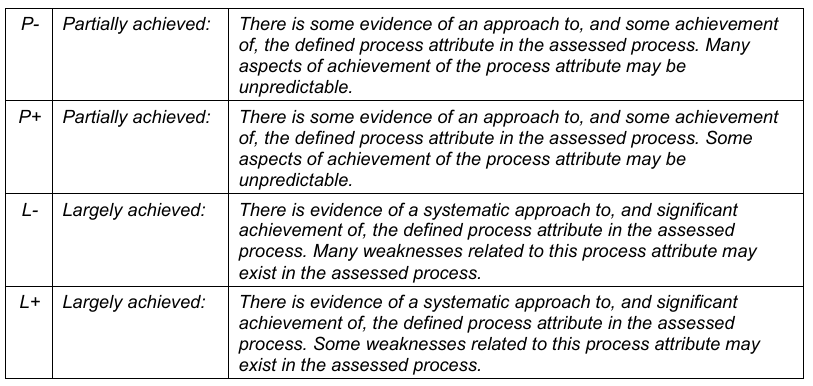
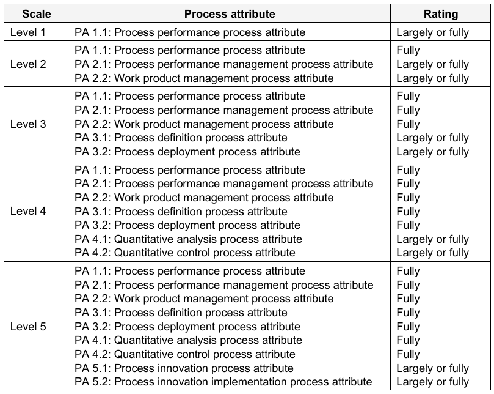
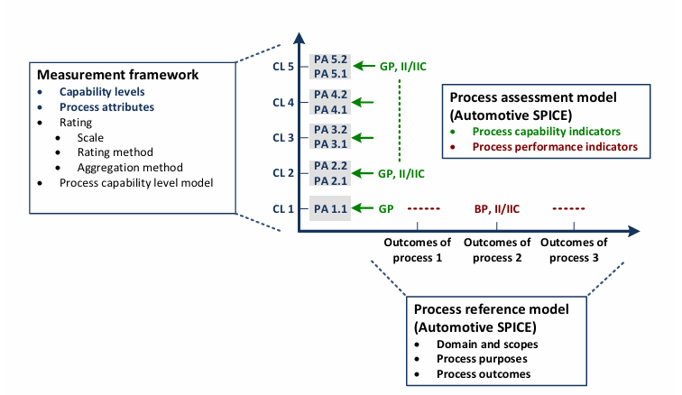

**NOTE**: All content here is AI generated and this notes prepared for study purpose. For detailed information visit [automotive-spice 🔗](https://vda-qmc.de/en/automotive-spice).

My focus in this notebook is towards Testing Topics.

- [ASPICE 4.0 Basics and Reference Manual 🔗](https://vda-qmc.de/wp-content/uploads/2023/12/Automotive-SPICE-PAM-v40.pdf)
- [ASPICE 4.0 Pocket Guide 🔗](https://www.ul.com/sites/default/files/2024-10/Automotive_Spice_Pocket_Guide.pdf)

# [ASPICE](https://vda-qmc.de/en/automotive-spice/automotive-spice-veroeffentlichungen)

## What is ASPICE?

ASPICE, or Automotive SPICE (Systems Process Improvement and Capability dEtermination), is a framework specifically designed to evaluate and improve the processes involved in developing automotive software and embedded systems. It's widely used in the automotive industry to ensure high-quality, reliable, and consistent processes during product development.

## Key aspects of ASPICE

- **Process Evaluation:** It assesses the capability of an organization’s processes against a set of standards.
- **Compliance with Standards:** ASPICE aligns with ISO/IEC 330xx standards, making it an internationally recognized framework.
- **Tailored for Automotive:** It includes process models specifically tailored to the needs of the automotive industry, focusing on safety, functionality, and efficiency.
- **Improvement Focus:** It not only identifies the current state of processes but also provides guidance for process improvement.

In essence, ASPICE helps organizations in the automotive industry enhance their processes to deliver better, safer, and more reliable products.

The Automotive SPICE Process Reference Model (PRM) and Process Assessment Model (PAM) conform to the ISO/IEC 33004:2015 standard, making them valid for assessing process capability.

The Measurement Framework aligns with ISO/IEC 33003:2015

## PAM relationship

## Process Reference Model (PRM)

The **Process Reference Model (PRM)** organizes processes into groups based on the activities they address. These groups are further categorized into three **process categories**:

1. **Primary Life Cycle Processes:** Focus on core development and delivery activities.
2. **Organizational Life Cycle Processes:** Address overarching management and organizational practices.
3. **Supporting Life Cycle Processes:** Provide supplementary functions that enhance overall performance.

### Key Features

- Each process has a **purpose statement**, which defines its unique functional objectives within a specific environment.
- Associated with each purpose statement is a list of **specific outcomes**, outlining the expected positive results of the process's performance.

In the process dimension, the Automotive SPICE PRM provides a comprehensive set of processes.

## Measurement Framework

The **Measurement Framework** establishes requirements and rules for evaluating the capability dimension, enabling assessors to determine the **Capability Level** of a process.

### Process Capability Levels and Process Attributes

The framework defines six capability levels, which represent a progression of process improvement:

1. **Level 0: Incomplete Process** - The process is not implemented or fails to achieve its purpose.
2. **Level 1: Performed Process** - The process is implemented and successfully achieves its intended purpose.
3. **Level 2: Managed Process** - The performed process is planned, monitored, and adjusted. Work products are established, controlled, and maintained.
4. **Level 3: Established Process** - The managed process is executed using a defined approach to reliably achieve the intended outcomes.
5. **Level 4: Predictable Process** - The established process operates predictively within defined limits. Quantitative management techniques are employed, with measurement data analyzed to address variations.
6. **Level 5: Innovating Process** - The predictable process is continually improved to adapt to organizational changes.

The determination of process capability within this assessment model is based on **nine process attributes (PA)**, each associated with specific capability levels. These attributes provide measurable properties for evaluating the capability of a process.

This attribute framework helps assessors gauge the capability of processes systematically, driving targeted improvements at each level.

### Process attribute rating

#### Rating Scale

#### Rating Scale percentage values

#### Refinement of rating scale

#### Refined rating scale

### Process capability level model

The **process capability level** achieved by a process is derived based on the ratings of process attributes according to the **process capability level model**. The achievement of each level is determined by fulfilling the requirements for all process attributes at that level and any lower levels.

This structured approach ensures a progressive improvement of process capability at each level.

## assessment indicators vs process capability

## Process reference model and performance indicators

### SWE.5 Software Component Verification and Integration Verification

#### **Process Purpose**

The purpose is to verify that software components are consistent with the software architectural design, and to integrate software elements and verify that the integrated software elements are consistent with the software architecture and software detailed design.

#### **Process Outcomes**

1. Verification measures are specified for software integration verification of the integrated software elements based on the software architecture and detailed design, including the interfaces of, and interactions between, the software components.
2. Verification measures for software components are specified to provide evidence for compliance of the software components with the software components’ behavior and
interfaces.
3. Software elements are integrated up to a complete integrated software.
4. Verification measures are selected according to the release scope considering criteria, including criteria for regression verification.
5. Software components are verified using the selected verification measures, and the results of the integration verification are recorded.
6. Integrated software elements are verified using the selected verification measures, and the results of the integration verification are recorded.
7. Consistency and bidirectional traceability are established between verification measures and the software architecture and detailed design; and bidirectional traceability is established between verification results and verification measures.
8. The results of software component verification and software elements integration verification are summarized and communicated to all affected parties

#### **Base Practices**

- **SWE.5.BP1:** Specify software integration verification measures
- **SWE.5.BP2:** Specify verification measures for verifying software component behavior
- **SWE.5.BP3:** Select verification measures
- **SWE.5.BP4:** Integrate software elements and perform integration verification
- **SWE.5.BP5:** Perform software component verification
- **SWE.5.BP6:** Ensure consistency and establish bidirectional traceability
- **SWE.5.BP7:** Summarize and communicate results

### Software Verification

#### Process purpose

The purpose of the Software Verification process is to ensure that the integrated software is verified to be consistent with the software requirements.

#### Process outcomes

1. Verification measures are specified for software verification of the software based on the software requirements.
2. Verification measures are selected according to the release scope considering criteria, including criteria for regression verification.
3. The integrated software is verified using the selected verification measures and the results of software verification are recorded.
4. Consistency and bidirectional traceability are established between verification measures and software requirements; and bidirectional traceability is established between verification results and verification measures.
5. Results of the software verification are summarized and communicated to all affected parties.

#### Base Practices

- **SWE.6.BP1:** Specify verification measures for software verification
- **SWE.6.BP2:** Select verification measures
- **SWE.6.BP3:** Verify the integrated software
- **SWE.6.BP4:** Ensure consistency and establish bidirectional traceability
- **SWE.6.BP5:** Summarize and communicate results

